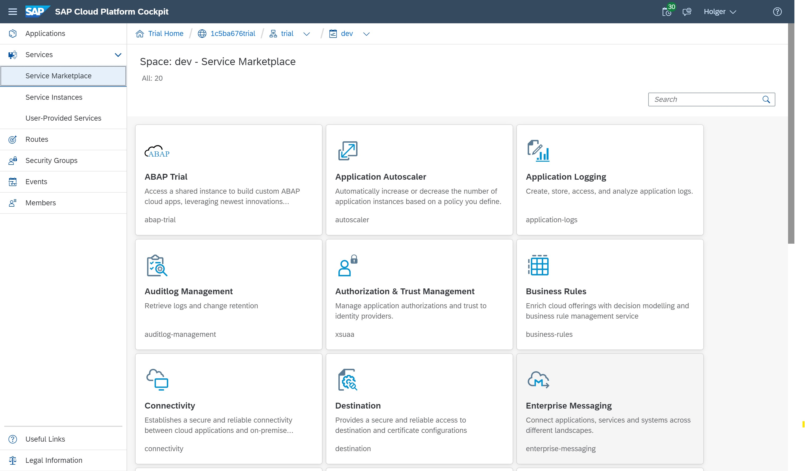
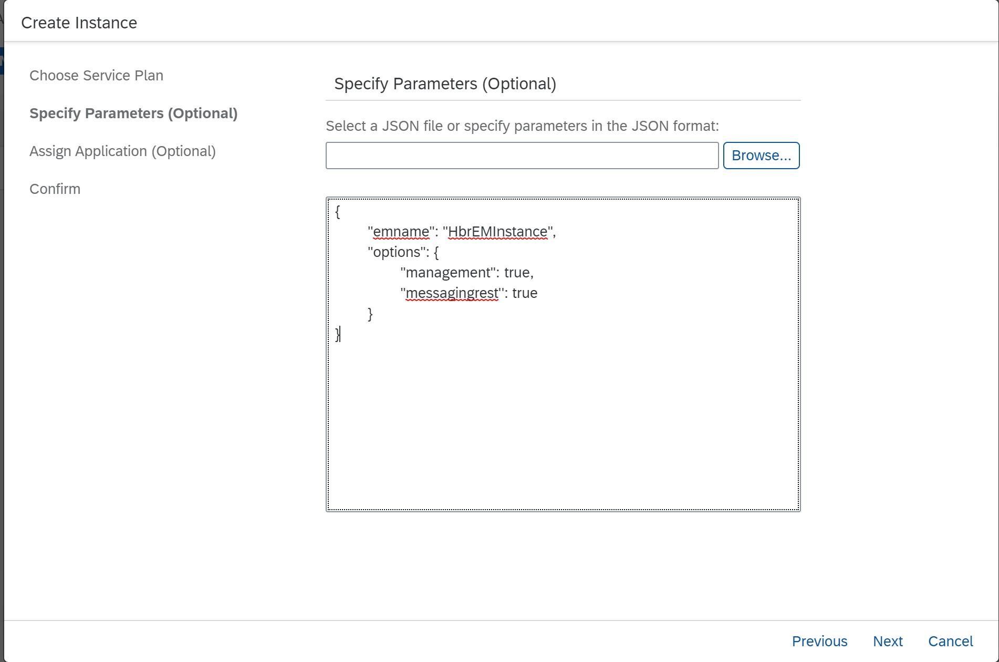
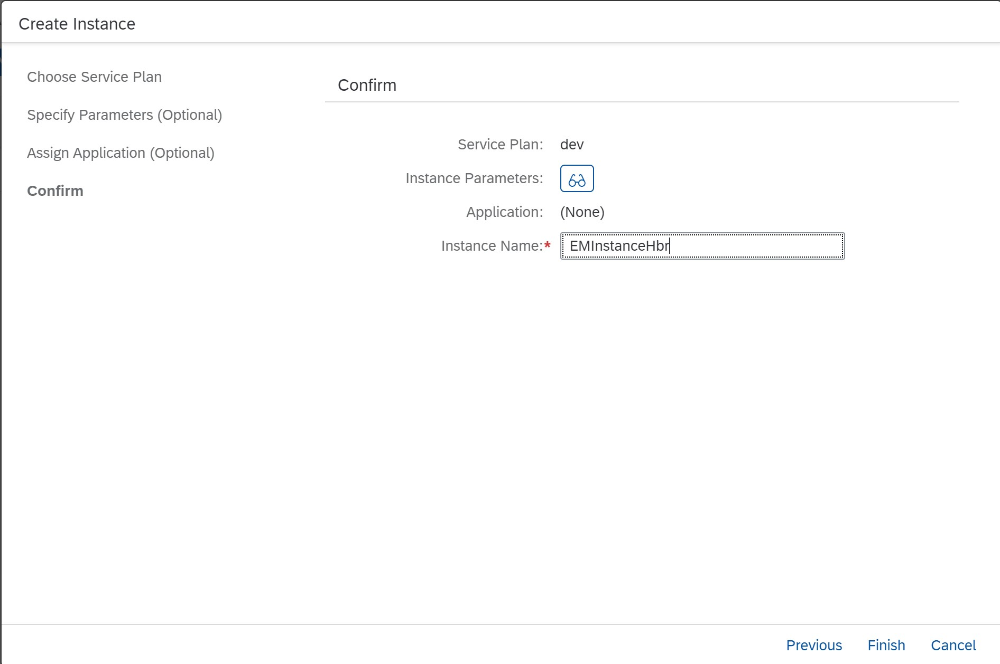
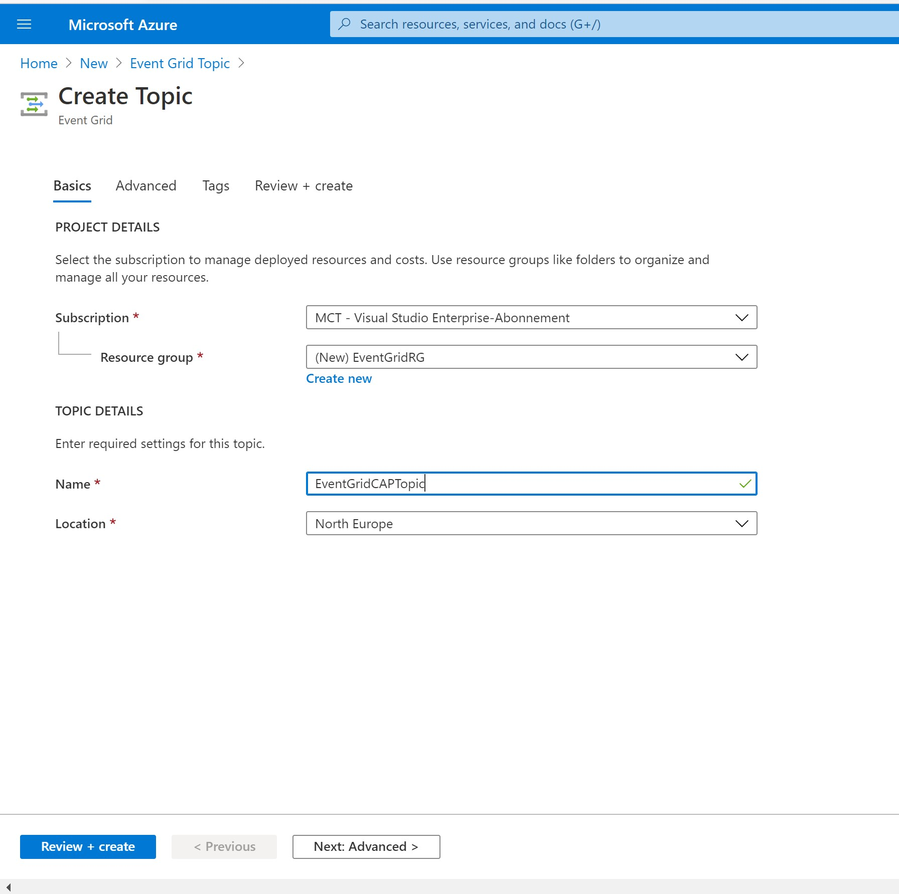
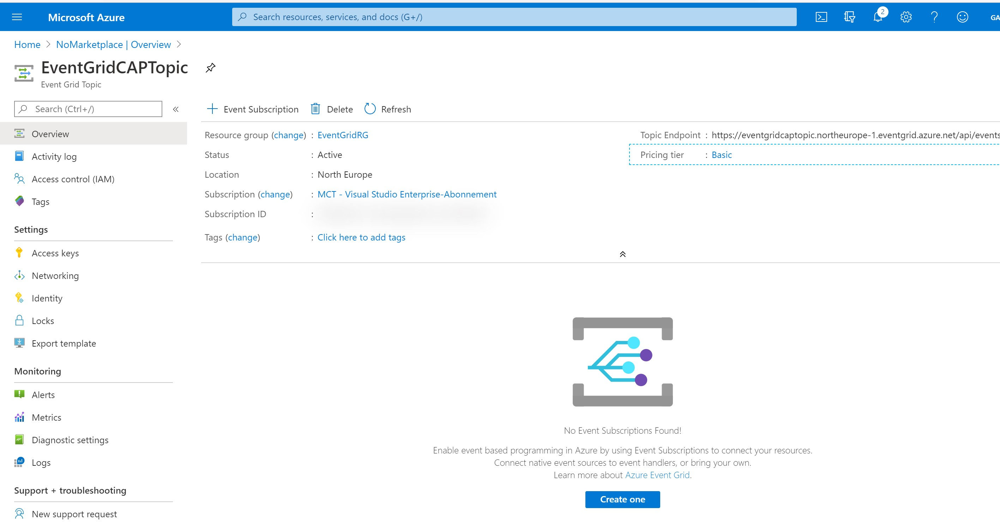
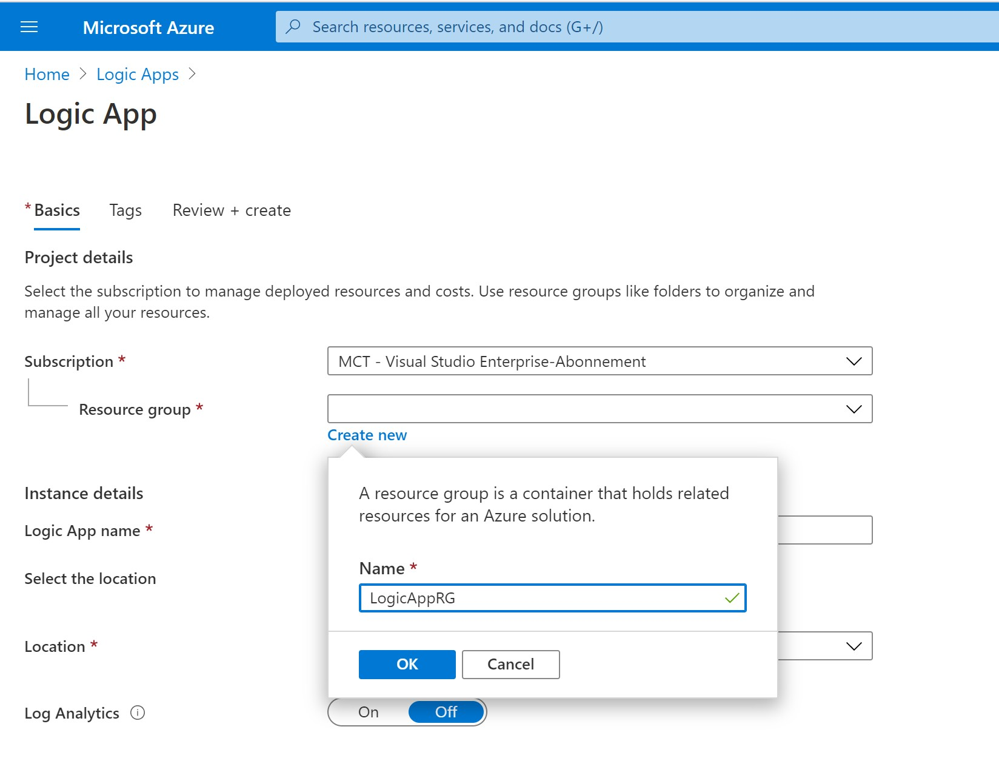
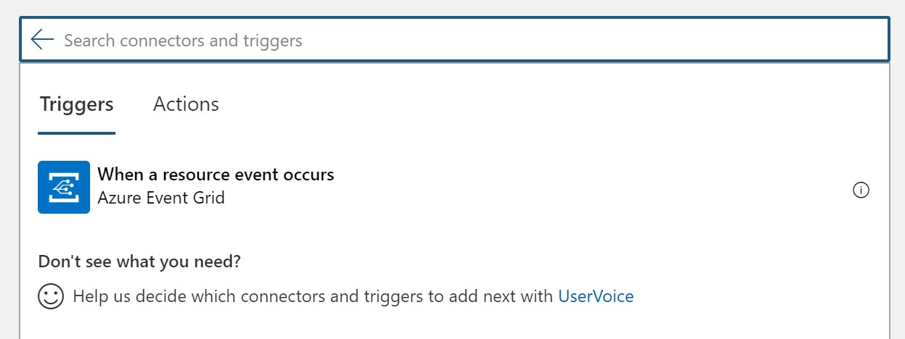
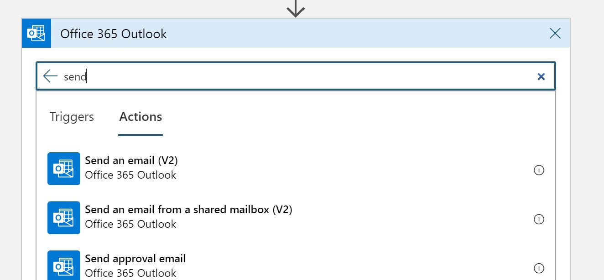
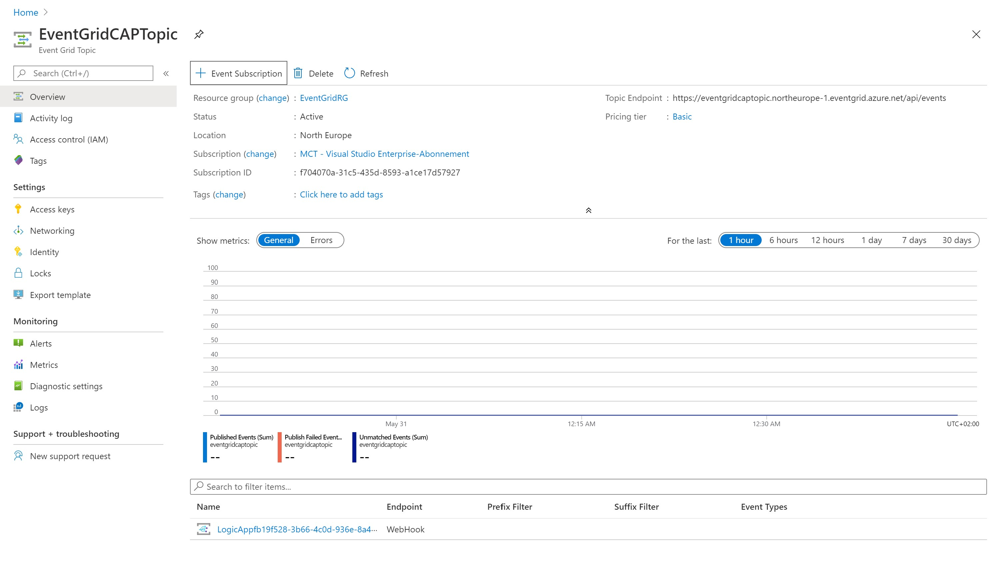

# CAP-EnterpriseMessaging-EventHub-LogicApps

This project outlines a POC on how you can leverage [SAP Cloud Platform Enterprise Messaging, EM](https://help.sap.com/viewer/bf82e6b26456494cbdd197057c09979f/Cloud/en-US/df532e8735eb4322b00bfc7e42f84e8d.html) to send Events to Microft [Azure Event Grid]() and from there to [Logic Apps](). The initial event that is sent to EM will be created via a sample app created with the [Cloud Application Programming Model](https://community.sap.com/topics/cloud-application-programming).  

The idea for this POC came after watching the great OpenSAP Course [Building Applications with SAP Cloud Application Programming Model](https://open.sap.com/courses/cp7) which introducted me to CAP and mentioned Enterprise Messaging. I thought: can I easily get these events to Azure as well?

> Keep in mind this is not (yet) a scenario that can be used in production (e.g. the authentication from EM to Event Grid is done via authentication in a Query paramater which you do not want to do in production!)

Special thanks to [Carlos Rogan](https://people.sap.com/carlos.roggan) and his tutorial series, [Tobias Griebe](https://people.sap.com/tobias.griebe) for his 1:1 help in setting up the initial EM <-> Event Grid connection and the OpenSAP & CAP team around [David Kunz](https://people.sap.com/david.kunz2) for their help and course. 


To start we will use the CAP app from a the recent OpenSAP Course [Building Applications with SAP Cloud Application Programming Model](https://open.sap.com/courses/cp7). In Week 4 Unit 3 of this fantastic course Eventing is explained. I highlighy recommend to check it out. We will take the final project from this unit which is available [here](https://github.com/SAP-samples/cloud-cap-samples/tree/openSAP-week4-unit3-final). Of course you could also follow the tutorial series by Carlos mentioned above, but why not take the app that is already avaialble from OpenSAP :-)

The first step is to enable EM on the SAP Cloud Platform. Following the steps to [Create Instance of SAP Cloud Platform Enterprise Messaging Service](https://developers.sap.com/tutorials/cp-enterprisemessaging-instance-create.html) you need to navigate to your Space and from there to Services -> Service Marketplace -> Enterprise Messaging Service. 


> If you do not see Enterprise Messaging, you need to configure entitlements on the Subaccount level


Select Instances -> New Instance


In the new *Create Instance* dialog click on Next in the step *Choose Service Plan*. In the next step *Specify Parameters (Optional)* you need to add some parameters. 

>Unlike in the Tutorial mentioend above you need to provide the following information in the **SCP Trial** environment as mentioned [here](https://help.sap.com/viewer/bf82e6b26456494cbdd197057c09979f/Cloud/en-US/6f694dcc608c41d390218848873dc6f3.html)

```json
{
	"emname": "HbrEMInstance",
	"options": {
		"management": true,
		"messagingrest": true
	}
}
```


Now you can just conitnue to click on Next. In the last step *Confirm* you can enter a name for your new instance, e.g. EMInstanceHbr


With this the new EM Instance is created 

and you can check out the Dashboard by clicking on the Instance and then on Open Dashboard 


---

As outlined in the course we will use the [SAP Business Application Studio, BAS]() for the development. If you have not done so, you can set it up following the instructions [here](https://developers.sap.com/tutorials/appstudio-onboarding.html). 

Obviously the *Enterprise Messaging - Messaging Administration* Dashboard will not show any Connection or Queues yet. These will be created by our CAP application later on. 
 

Once in the BAS open a Terminal via Terminal -> New Terminal. 


You can clone the OpenSAP GitHub repo using 
```
git clone https://github.com/sap-samples/cloud-cap-samples projects/cloud-cap-samples -b openSAP-week4-unit3-final
```


The app is ready to run, but in order to connect it to the Enterprise Message Instance we created earlier, we need to make some changes in the code. We will also adjust the configuration so that EM can be used even if the application is not deployed to SCP Cloud Foundry. 

The first thing that needs to be changed is in the package.json here. Here Enterprise Messaging is currently not enabled so we need to remove the --- in line #27


Next we need to deploy the app to SAP Cloud Platform. In order to do this we create a file manifest.yml in the root folder with the name of the CAP application and the name of the Enterprise message Service Instance Name that we created before, e.g. EMInstanceHbr 
```json
applications:
- name: OpenSapCAPApp
  services:
    - EMInstanceHbr
````


Now we can deploy the application to SAP Cloud Platform CF. In the terminal do a 
```
cf api https://api.cf.us10.hana.ondemand.com
```
where https://api.cf.us10.hana.ondemand.com is the API Endpoint that can also be found in the Subaccount Overview page


After the *cf api* command you can then log in to your SCP account using 
```
cf login
```


Now you are ready to push the application to SCP CF using 
```
cf push
```


Once the application is deployed you can retrieve the environment information via 
```
cf env OpenSapCAPApp
```


You can Copy all the information from *System-Provided* till *No user-defined env variables have been set* to the clickboard


Then create a new file called default-env.json and paste the environment information into it. 

You will see that there is an error in the json structure at line #83


In order to fix this, remove the two *} {* and add a *,*


Now we are ready to run the application and test the sending of Events to Enterprise Messaging. First run a 
```
npm install
```
to install the required packages for Enterprise Messaging. 


Once that is done start the app via 
```
cds watch
```


Now the app is running localy on port 4004 and the Business Application Studio is proxying the URL to a public endpoint like https://1c5ba676trial-workspaces-ws-qmf6k-app1.us10.trial.applicationstudio.cloud.sap/


so we can test sending a *PATCH* request to the App which send an event to Enterprise Messaging. Just open the file *req.http* and click on *Send Request*


That's it. If you head back over to the Enterprise Messaging Dashboard you can see that a new Queue has been created. 


Azure Event Grid does support several messages formats. One of these formats is the [CloudEvents Schema](https://github.com/cloudevents/spec/blob/v1.0/spec.md). This schema requires certain attributes and headers that we need to set. 
Open the *API_BUSINESS_PARTNER.js* file in the srv -> external folder. Here we need to set the required CloudEvents attributes specversion, type, source and id. 


Finally we also need to set the Content-Header varaible (which by default is set to 	application/octet-stream) to application/cloudevents+json


---

Now we are ready to switch the sides and head over to Azure. 
> If you do not have an Azure account, you can create a [free Trial](http://azure.com/free). 

Open the [Azure Portal](https://portal.azure.com/) and click on *+ Create a resource*


Search for Event Grid and click on *Event Grid Topic*


Now click on *Create* to create a new Event Grid


Create a new Resource Group called *EventGrid RG*


and enter a Topic name


Finally click on *Review + Create* and once the validation is successful on Create. After a few minutes the Event Grid should be deployed and by clicking on *Go to resouce* you can open the Event Grid in the Azure Portal.


Under Topic Endpoint you can see the URL that must be called from SCP Enterprise Messaging if a new event arrives, e.g. https://eventgridcaptopic.northeurope-1.eventgrid.azure.net/api/events

Before we configure this on the SAP side, lets configure a Logic App which can pick up the incoming event and processes the result. In our case the incoming data will just be send via Email. Obviously this could be much more. Logic App comes with a huge list of action you can choose from like XXX. 

So in the top Search bar look for *Logic App* and select Logic Apps under *Services*


Now click on *+ Add* to create a new Logic App


First create a new Resource Group, e.g. LogicAppRG


Then enter the name of the Logic App, e.g. EventGridLogicApp and click on *Review + create* and after successful Review on *Create* again. 


Once the Logic App is create, it will immediately open the *Logic dpp designer*. Scroll down and select the *+ Blank Logic App*


Now in the Designer search for the *Event Grid* Trigger and select *Azure Event Grid*


Select the *When a resource event occurs" trigger


When you select your Subscription and the Resource Type *Microsoft.EventGrid.Topics* you should see your Event Grid under *Resource Name* that you had previously created. 


With this you can click on *+ Next step* to select a next action. As mentioned this could be any service running on Azure or also services from 3rd party like SAP. We will send the properties via Email using Office 36z5 Outlook. Search for *Office 365* and select *Office 365 Outlook*  


> You can obviously also select any other SMTP server to send email an email (e.g. using Outlook.com or Gmail)

Search for Send and select *Send an Email (V2)* 


Enter the required properties. For the Body field use the *Dynamic Content* on the right hand side. You might need to click on *See more* next to *When a resource event occurs* to see all available properties from the first step in this Logic App flow. 


Make sure to click on Save!

> There is one manual fix that we need to do since we are using the *Cloud Events* schema and not the *Event Grid* schema. Whereas Event Grid expects and array structure, the Cloud Events schema starts with a single structure. 

Please open the *Code View* and remove the splitOn line.    


If you would head back to the Event Grid Topic previously created, you can see that new Subscription pointing to the Logic App is now shown. 


---

Now we are ready to go back to the SAP Cloud Platform Enterprise Messaging Dashboard. 

Click on *Webhook Subscriptions* and click on *Create*


Here comes the POC part. Currently Event Grid does only support authentication via Shared Access Keys, while SAP SCP Enterprise Messaging does support *No Authentication*, *Basic Authentication* and *OAuth2ClientCredentials*. Since headers cannot be modified in Enterprise Messaging, we need to send the SAS Key for the Event Grid as a Query parameter visible in the URL -- which is obviously not good in a production environment. Still for this POC we will take the *Access Key 1* from Azure, 


Since we send them via an HTML URL we need to URL encode them. This basically means that we change the ending *=* into a *%3D*


The status of this new Webhook Subscription might be *Paused*. So click on the *Resume* button to active this service. 


---

Now all is done. Head back over to the Business Appliation Studio and trigger another PATCH call. 


